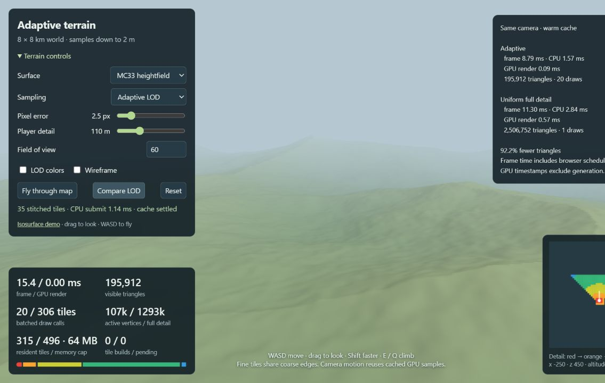
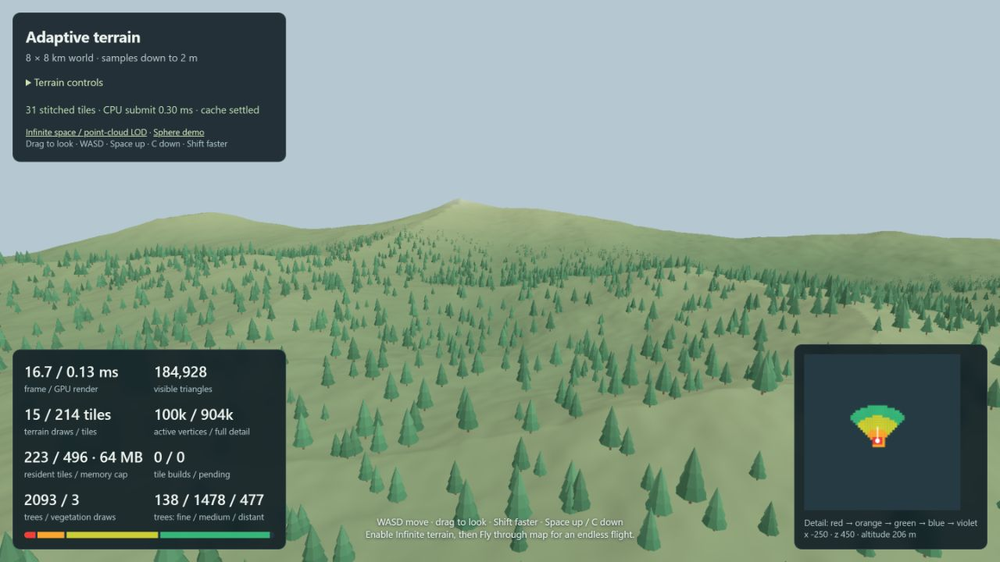
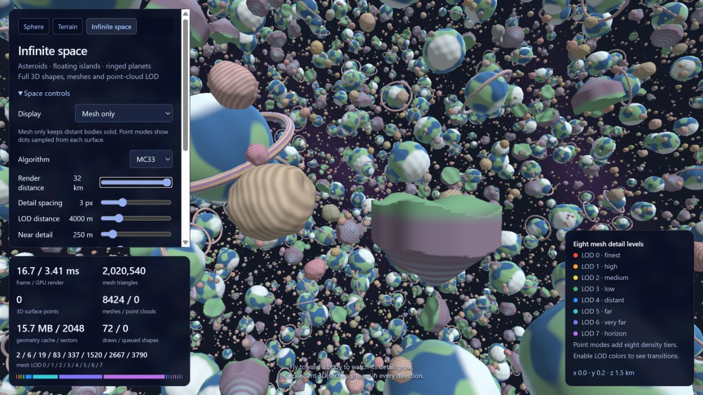

# Marching Cubes — Bourke and MC33

**New:** [Adaptive terrain demo](http://127.0.0.1:8000/terrain.html) — an 8 × 8 km
GPU terrain map with player/camera-driven sampling, stitched LODs, a resident
cache, an optional infinite flythrough, a render-distance slider, and an
adaptive-vs-uniform benchmark. Space climbs and C descends; terrain has no fog.
Instanced forests have three tree LODs, their own distance slider, and roots
attached to the current stitched terrain triangles. Settled views reuse draw plans.
See [terrain documentation](docs/TERRAIN.md)
and [the HPLOC / older LOD source review](docs/terrain-source-review.md).

[Infinite space demo](http://127.0.0.1:8000/space.html) streams a 3D field of
asteroids, floating islands with optional caves, and ringed planets. Choose adaptive
meshes, nested surface point clouds, or a hybrid; MC33 and Bourke both extract
the full volumetric shapes. Mesh only is the default, with eight mesh detail levels,
LOD distance and near-detail controls. Demo links are at the top of each page. Fly in any
direction, adjust distance up to 32 km, and enable LOD colors or full detail to
compare. See [space documentation](docs/SPACE.md).

Switch between classic [Paul Bourke isosurfaces](https://paulbourke.net/geometry/polygonise/)
and Marching Cubes 33 on CPU or WebGPU. The sphere demo fits the actual source
points and reconstructs a tight shell. Algorithm changes reuse the same samples.

MC33's lookup tables and WGSL face/interior ambiguity decisions come from the
planet cloud shader in `vibe_code_experiments/noiseCompute/tools/clouds`. The
matching JavaScript decisions come from that project's MC33 demo. The previous
experimental center-fan method has been replaced by the full MC33 pattern selection.

## Recorded benchmark views

These screenshots are checked into [`docs/benchmarks`](docs/benchmarks) so the
visual result and the measurements stay with the implementation.



The terrain view shows the same warm camera comparing adaptive and uniform
sampling: 195,912 versus 2,506,752 triangles (92.2% fewer), 8.79 ms versus
11.30 ms frame time, and 0.09 ms versus 0.57 ms GPU render time. CPU submission
was 1.57 ms adaptive versus 2.84 ms uniform in that capture.



The forest capture shows the tree pass running with the terrain: 2,093 trees in
three vegetation draw batches, with 138 near, 1,478 mid-distance, and 477 far
tree instances. The terrain HUD reports 184,928 visible terrain triangles and
0.13 ms GPU render time in this view.



The space view uses mesh-only rendering at the 32 km distance limit. The HUD
shows 2,020,540 triangles across 8,424 bodies in 72 draws, with all eight mesh
levels active. The stress comparison held the visible bodies constant and
reduced the five-level baseline from 9,971,348 to 2,020,660 triangles (79.7%
fewer). These are local captures; timings vary with browser, viewport, and GPU.

## Run the demo

From this directory, run `npm start` (Node.js required), then open
[the demo](http://127.0.0.1:8000/marchingcubesclassic.html).
Any static HTTP server works. CPU mode can also be used by opening
`marchingcubesclassic.html` directly. Three.js loads from its existing CDN.

Use **Algorithm**, **Compute**, and **Coordinates** to select the extraction
method. Choose **Outer only**, **Inner only**, or **Both**, adjust the shell
thickness or surface offset, and enable wireframe to inspect the result. CPU is the
default; WebGPU requires a supported browser and a secure context (localhost or
HTTPS). Unsupported browsers retain CPU mode. Timings include extraction and
geometry preparation; GPU timings include compilation on the first run and readback.
No `npm install` is needed.

## Reusable extraction API

The scripts in `src/` use ordinary browser globals and CommonJS exports, with no
build step or package dependencies. Load them in the same order as the HTML demo,
or use them from Node:

```js
const MarchingCubes = require('./src/marchingCubes.js');
const size = { x: 32, y: 32, z: 32 };
const field = new Float32Array(size.x * size.y * size.z);
// Fill field[(z * size.y + y) * size.x + x] with scalar samples.

const positions = MarchingCubes.extractCPU(field, size, 0.5, 'mc33');
// In a WebGPU browser with an existing GPUDevice:
// const positions = await MarchingCubes.extractGPU(device, field, size, 0.5, 'mc33');
```

Both methods return `Float32Array` triangle soup `[x,y,z, x,y,z, ...]`.
Use `'bourke'` or `'mc33'` for the algorithm. Without a coordinate option, output
occupies the normalized Cartesian domain `[0,1]^3`. Each algorithm preserves its
source table's winding convention; the demo renders both sides.

The GPU runner caches pipelines and lookup buffers per device, splits the volume
into overlapping Z sample bricks, reads back only emitted vertices, and destroys
temporary buffers after each brick. Capacity accounts for Bourke's maximum 15
vertices per cell and MC33's maximum 36. Call `await MarchingCubes.disposeGPU(device)`
when done with the cached GPU resources.

## Spherical and cloud coordinates

MC33 extracts on a structured grid; it can use Cartesian cells or cells in a
coordinate parameterization. Both algorithms support:

| Mode | Grid axes | Options |
| --- | --- | --- |
| `cartesian` | x, y, z | Normalized `[0,1]^3` |
| `spherical` | longitude, latitude, radius | `longitude`, `latitude` in radians; `radius`, `center` |
| `cube-sphere` | face u, face v, radius | `face` from 0 to 5; `radius`, `center` |

```js
const Coordinates = require('./src/coordinates.js');
const coordinates = {
  type: 'spherical',
  longitude: [-Math.PI, Math.PI],
  latitude: [-Math.PI / 2, Math.PI / 2],
  radius: [0.1, 0.6],
  center: [0, 0, 0]
};
const field = Coordinates.sampleField(size,
  (x, y, z) => Math.hypot(x, y, z) - 0.33, coordinates);
const positions = MarchingCubes.extractCPU(field, size, 0, 'mc33', { coordinates });
// extractGPU accepts the same options after the algorithm argument.
```

Spherical defaults are longitude `[-pi,pi]`, latitude `[-pi/2,pi/2]`, radius
`[0.02,0.7]`, center `[0.5,0.5,0.5]`. `sampleField` duplicates the longitude seam
for full-circle grids. Latitude poles collapse to single world-space points;
pole triangles can be degenerate. For uniform angular sampling without pole
singularities, use the cloud shader's `cube-sphere` mapping and extract all six
faces, sampling the same world-space field at shared boundaries.

Extraction interpolates in parameter coordinates, then maps the result into
world coordinates. GPU coordinate mapping currently happens on the CPU after
readback. Triangles remain flat approximations of the curved domain. The cloud
shader's code-12 vertex uses the cell center; cloud-specific projection, temporal
filtering, noise generation, and normal smoothing are not part of this port.

The demo fits a sphere to the generated point cloud by least squares, samples
`distance(center, position) - fittedRadius` directly in each coordinate system,
and caches those grids. Offset 0 puts the outer boundary at the point-cloud radius;
the inner boundary sits one shell thickness inside it. Each boundary is extracted
independently, so a thin shell cannot disappear between grid samples. Extracted
vertices are projected onto their fitted sphere and receive smooth radial normals,
with inward winding/normals for the inner surface and collapsed pole triangles
removed. Both panels use identical camera positions and scale.

This fitting step is specific to spherical point clouds; it is not a general
point-cloud reconstruction algorithm. The original summed Gaussian utility remains
available as `DemoFields.createScalarField`. Reusable extraction APIs still accept
arbitrary scalar fields without fitting or projection. Comparing algorithms within
a coordinate mode uses identical samples; switching modes changes the lattice.

## Verification

- `npm test`: mask coverage, ambiguity decisions, shared faces, closed meshes,
  coordinate mappings/seams, input validation, and GPU brick limits.
- Serve the repo and open `tests/webgpu.html`: 56 CPU/WebGPU geometry and winding
  comparisons, including all masks, exact crossings, split bricks, spherical
  mapping, all six cube-sphere faces, and tight inner/outer sphere boundaries.
- `tests/terrain-webgpu.html`: terrain generation, stitches, caching, infinite
  travel, instanced tree LODs, and a fixed-view CPU draw-plan comparison.
- `tests/space-webgpu.html`: actual worker extraction/GPU rendering, all display
  modes, adaptive/full-detail comparison, vertical/99 km travel, and cache budgets.
- `tests/space-stress-webgpu.html`: 32 km comparison of five versus eight mesh
  levels with identical visible bodies and production budgets; stationary batch
  reuse and all eight drawn LODs.

See `THIRD_PARTY_NOTICES.md` for source attribution. The original classic-only
[CodePen demo](https://codepen.io/mootytootyfrooty/pen/pvJREbv) remains an older version.
